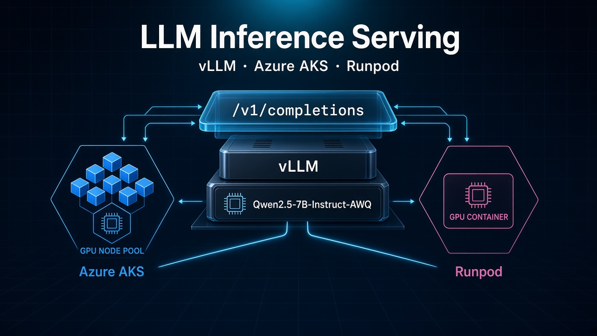
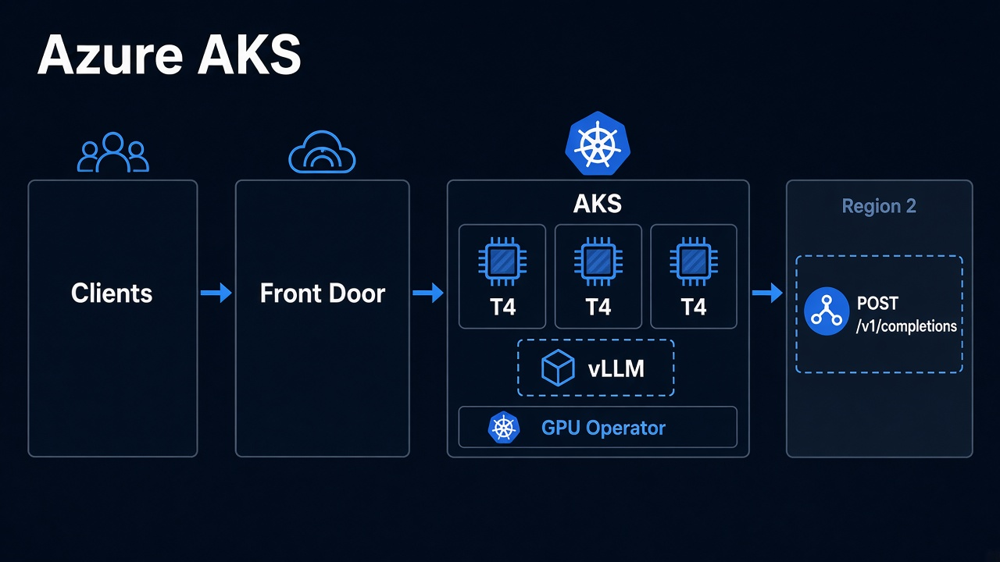
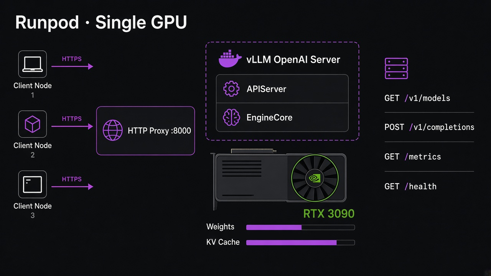
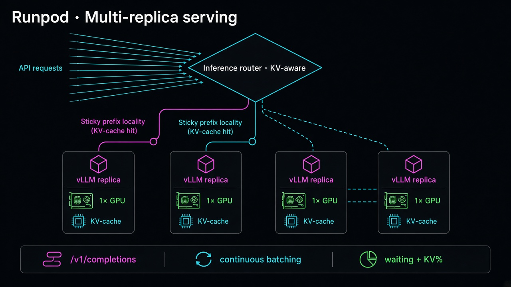

# LLM-Inference-Serving-Azure-AKS

[](LICENSE)
[](https://www.python.org/)
[](https://docs.vllm.ai/)
[](https://docs.vllm.ai/en/latest/serving/openai_compatible_server.html)
[](https://huggingface.co/Qwen/Qwen2.5-7B-Instruct-AWQ)
[](https://www.terraform.io/)

[](https://learn.microsoft.com/azure/aks/)
[](https://www.runpod.io/)
[](https://kubernetes.io/)
[](https://docs.nvidia.com/datacenter/cloud-native/gpu-operator/latest/index.html)
[](https://github.com/javakishore-veleti/LLM-Inference-Serving-Azure-AKS/commits/main)
[](https://github.com/javakishore-veleti/LLM-Inference-Serving-Azure-AKS/issues)
[](https://github.com/javakishore-veleti/LLM-Inference-Serving-Azure-AKS/stargazers)

Deploy **vLLM** serving for **Qwen2.5-7B-Instruct-AWQ** on **Azure AKS**, **Runpod**, or both — same OpenAI-compatible door: `POST /v1/completions`.

Azure AKS: Terraform, NVIDIA GPU Operator, GPU node pool. Runpod: a pinned `vllm/vllm-openai` container on a GPU host (this lab: community RTX 3090) when AKS quota is unavailable. Clients hit `/v1/completions` on whichever path is live.



## Table of Contents

- [Why self-hosting LLM Serving instead of calling Frontir Model(s) API?](#why-self-hosting-llm-serving-instead-of-calling-frontir-models-api)
- [Open Source vs Closed Source Models](#open-source-vs-closed-source-models)
- [vLLM Model Serving on Azure AKS](#vllm-model-serving-on-azure-aks)
  - [Why Kubernetes?](#why-kubernetes)
  - [Why AKS Specifically?](#why-aks-specifically)
- [The Driver Decision](#the-driver-decision)
  - [Why hand the driver to the Operator rather than the node image?](#why-hand-the-driver-to-the-operator-rather-than-the-node-image)
  - [Measured memory at --gpu-memory-utilization=0.90](#measured-memory-at---gpu-memory-utilization090)
- [Pinned Versions](#pinned-versions)
  - [This repo UV Setup on Macbook](#this-repo-uv-setup-on-macbook)
- [You To Be A Golden Start of vLLM Management](#you-to-be-a-golden-start-of-vllm-management)
- [RunPod Management](#runpod-management)
  - [GitHub Actions](#github-actions)
  - [Boot log analysis](#boot-log-analysis)
  - [vLLM-specific metrics](#vllm-specific-metrics)
  - [Observability tools](#observability-tools)
  - [Configurations](#configurations)
  - [10 million requests per hour](#10-million-requests-per-hour)
    - [What “tokens × batching” and the 8 000 RPS peak mean](#what-tokens--batching-and-the-8-000-rps-peak-mean)
    - [How many pods](#how-many-pods)
    - [How to track](#how-to-track)
    - [Availability](#availability)
    - [Regional failover](#regional-failover)
    - [KV cache, metrics, and dashboards](#kv-cache-metrics-and-dashboards)
  - [Cluster of vLLM, API router, load balancer](#cluster-of-vllm-api-router-load-balancer)
- [References](#references)

---

## Why self-hosting LLM Serving instead of calling Frontir Model(s) API?
* Cost at scale - per-token API pricing stops making sense past a certain volume
* Data and privcay - prompts never leave your network
* Model and latency control - run whatever model you want, tune the engine,  own the tail latency instead of inherting someone else's

## Open Source vs Closed Source Models
* Open Source - the weights are downloadable (Hugging Face and similar). You get the actual parameter file, can run it on your own GPU, fine-tune it, with no per-token fee. Examples: Llama, Qwen, Mistral, DeepSeek.

*Closed Source - you only get an API endpoint (GPT, Claude, Gemini). No weights, no self-hosting, you need a prompt over HTTPs and pay per token.

You cannot self-host a closed model - there are no weights to put on a GPU. That is why this repo serves Qwen, an open-weight model.

## vLLM Model Serving on Azure AKS



### Why Kubernetes?
A single GPU box running python -m vllm... would serve tokens too. Kubernetes earns its place on what comes after:


* Scheduling - GPUs become a countable resource (nvidia.com/gpu: 1), not just a machine (note that GPU is an expensive resource)
* Isolation - taints and source requests keep cheap pods off the expensive card and stop two containers fighting over one GPU
* Self-healing - the pod dies, it restarts behind a stable Service address
* Autoscaling - HPA/KEDA on the pod, node pool to zero between sessions
* Rollouts - canary and blue/green deployments are built-in primitives, no scripts
* Ecosystem - GPU Operator, DCGM Metrics, MIG and time-slicing all ship as Kubernetes components
* Portability - the same manifests run on any cloud's managed Kubernetes

### Why AKS Specifically?
Azure runs the control plane for free (sku_tier = "Free" ), and node pools are a first-class resource, so the GPU pool is one Terraform block.

## The Driver Decision
AKS can install an NVIDIA driver for you. This repo deliberately tells it not to.

```text
gpu_driver = "None"
driver.enabled = true
```

### Why hand the driver to the Operator rather than the node image?
The drivers lifecycle becomes decouple from the OS image. You can upgrade it or pin it per node pool without rebuilding an image drift between nodes stops being invisible, and the driver container toolkit, device plugin, node-feature-discovery and DCGM exporter all arrive as one Helm-versioned, mutually validated stack.

The cost is cold start. The driver DaemonSet must pull, install and pass health checks before the node can schedule the GPU pods at all. That is a real tradeoff, not a free win.

### Measured memory at --gpu-memory-utilization=0.90
| Item | VRAM |
| --- | --- |
| Total card | 15360 MiB |
| Allocated by vLLM (nvidia-smi) | 13605 MiB |
| Weights + runtime overhead | ~ 5.97 GiB |
| Available KV Cache | 7.32 GiB |

KV Cache - not weights - sets the concurrency ceiling. KV Cache is useful for concurrency.

## Pinned Versions
| Component | Pin |
| --- | --- |
| Terraform | ~> 1.15 |
| azurerm provider | ~> 4.0 |
| Kubernetes / Helm Providers | ~> 2.35 / ~> 2.17 |
| AKS Kubernetes Version | null AKS default for the region |
| GPU VM | Standard_NC4as_T4_v3 |
| GPU node OS | Ubuntu2204 (containerd 1.7 - see traps above) |
| System VM | Standard_D2s_v3 |
| GPU Operator Chart | v26.3.2, driver.enabled=true |
| vLLM image | vllm/vllm-openai:v0.22.1 (never: latest) |
| Model | Qwen/Qwen2.5-7B-Instract-AWQ (ungate - no HF token needed) |

Pinning the vLLM image matters more than it looks: :latest changes engine defaults under you, and a config that worked yesterday OOMs today. On a 15GiB card that margin is thin.

### This repo UV Setup on Macbook
```shell
uv add torch torchvision transformers streamlit requests pyairports
```
- Below command does not work on Mac because those packages are a Linux + NVIDIA GPU serving stack. 
- uv add tries to put them in the local .venv, and that is what blew up:
- vllm xformers Not installable — they need CUDA
- So Run vLLM on the AKS GPU node (the vllm/vllm-openai image), not in Mac laptop venv.

```shell
# Does not work on Macbook
uv add torch torchvision vllm transformers streamlit requests pyairports xformers 

```

## You To Be A Golden Start of vLLM Management

This is not a tutorial. It is the story of the same model, the same OpenAI door, and the difference between “I got a 200 once” and **owning** a vLLM deployment — on Runpod first, then anywhere GPUs live.

You start where everyone starts. Azure will not give you a T4. Quota is `0/0`. So you rent a community RTX 3090 on Runpod and you type `vllm serve`. You feel close. The pod says `RUNNING`. You curl `/` and get **404**. You wait. The GPU is already billing.

That 404 is the first chapter. vLLM never lived at `/`. The door is `/v1/models` and `/v1/completions`. Runpod’s probe knocks on the wrong room and you think the house is empty. A golden start learns the **HTTP contract** before the model name: health, models, completions, chat, metrics. `GET /` is a ghost. `--host 0.0.0.0` and `8000/http` must exist **at create**; you cannot bolt a port onto a living pod.

The second chapter is a silent bill. You pin `vllm/vllm-openai:v0.22.1` because that is the lab image. The host driver is older. `nvidia-container-cli: cuda>=13.0`. Python never starts. There is no banner, no Uvicorn, no KV line. The card is still yours until you **delete**. Community GeForce wants **`v0.22.1-cu129`**. You do not set `NVIDIA_DISABLE_REQUIRE` to “make it work.” You match image to driver, or you pay for a brick. `:latest` is how yesterday’s config OOMs today.

You recreate. Now the story has two clocks. Docker is still pulling when the UI says running. Then pid 95 prints a banner and you think you are served. You are not. Hugging Face is copying **5.19 GiB**. Inductor is compiling for twenty seconds. CUDA graphs are being recorded on **this** GPU. Only `Application startup complete` plus a 200 on `/v1/models` is Ready. Curl during the movie is 502. The first real completion still JIT-compiles a Triton kernel. Warmup is a character in the plot, not a footnote. Mount `/root/.cache/huggingface` so the second night does not re-download the same weights. Compile cache lives there too. Graphs do not travel between SKUs.

While you wait you learn what a 7B actually is. The name sounds like seven billion parameters of GPU. AWQ packed the weights into **5.29 GiB**. The rest of the 90% budget is not “headroom.” It is the **KV cache** — 14.43 GiB, 270k tokens, enough in theory for ~66 full 4096-token lives. `max_num_seqs=8` is you choosing latency over greed. `--gpu-memory-utilization=0.90` never meant “90% for weights.” When `kv_cache_usage_perc` walks to 1.0 the engine **preempts**. TTFT falls off a cliff and nobody OOM-killed. That is the SME sentence: **KV is the product; weights are the rent.**

You pick knobs like product, not flags. `max_model_len` is how much conversation you sell per request, and how many people share the arena. Quantization must match the checkpoint; the log offers `awq_marlin` for speed and you A/B it instead of arguing. Prefix cache is on in V1 and worth nothing if a round-robin balancer sprays one system prompt across two hundred strangers. `generation_config.json` will raise temperature behind your back unless the client or `--generation-config vllm` owns sampling. `--served-model-name` is the name your app can keep when you change Hub ids. `--api-key` exists because the proxy URL is otherwise the password. `--disable-log-requests` exists because prompts in logs are an incident. `--trust-remote-code` is supply chain. `--wait` on Runpod is SSH, not the model.

You learn money the same day. Stock moves faster than price. 4090 plus `--public-ip` plus `--wait` is sold out. 3090 without a public IP starts. Disk and volume add pennies; the GPU is the meter. `stop` is a pause. `delete` is zero. A failed CUDA pod that never booted is not free. Image, ports, and docker-args are immutable: wrong CUDA means a new pod, not an edit.

Then traffic arrives — not one Hello, ten million an hour in your head. 10M/h is **~2,778 RPS**. This replica holds about **ten**. You do not buy a bigger load balancer. You clone the unit you just understood: one GPU, one EngineCore, one KV arena. Two hundred eighty of them, plus headroom, plus a second region if a datacenter can vanish. Round-robin at that scale is spraying sessions across databases. The router must love **prefix locality and KV load**. Failover cannot copy KV to another continent; the surviving region is cold in the cache and hot in TTFT until it warms. You scrape `vllm:*` and DCGM. You page on **waiting, KV %, TTFT p95**, not CPU. You never scale this fleet to zero if the SLO cannot eat a two-minute boot.

You also know when the story leaves Runpod. One container proved the OpenAI door. Instant Clusters are not Kubernetes. Regional Front Door, PDB, HPA on waiting, DCGM on every node, canary images — that is AKS (when quota exists). Serverless Hub is a different API and a different cold start. Gold on **one** GPU is a pin, a volume, a real Ready, a key, `/metrics`, and a delete. Gold **in general** is that replica as a cell you can clone without lying to yourself about KV, CUDA, or the bill.

That is the golden start of vLLM management: you can tell the story of a request from driver check to first token, and you know which chapter is on fire.

## RunPod Management



Azure T4 quota blocked AKS (`NCasT4v3` 0/0). Same model and OpenAI API were served on a **Runpod community RTX 3090** instead. That is one Docker container, not Kubernetes. Image pin on GeForce hosts: `vllm/vllm-openai:v0.22.1-cu129` (plain `v0.22.1` is CUDA 13 and will not start).

CLI runbook: [`imp-commands-runpod.md`](imp-commands-runpod.md). Terraform: `terraform/runpod/`. Every VRAM number, boot clock, and kernel choice below is from one real container log — walk it in [`README_RUNPOD_LOGS_ANALSYS.md`](README_RUNPOD_LOGS_ANALSYS.md).

### GitHub Actions

Secret: **`RUNPOD_API_KEY`** (repo Settings → Secrets and variables → Actions).

| Workflow | What it does |
|---|---|
| `RUNPOD-ALL-SETUP-0001-EndToEnd` | List pods → `terraform apply` → curl `/v1/models` + `/v1/completions` |
| `RUNPOD-ALL-DESTROY-0001-EndToEnd` | `terraform destroy` → list pods (GPU bill → $0) |
| `RUNPOD-0001` … `0004` | Same steps, one workflow each |

Do not run Setup twice without Destroy. GPU bills from apply until destroy.

The verify step is a 200 on `/v1/models` and `/v1/completions`, not pod `RUNNING`. Setup can still 502 while Hugging Face and `torch.compile` run — that movie is timed in [the two-minute log](README_RUNPOD_LOGS_ANALSYS.md#the-two-minute-movie) (`13:15:37` banner → `13:17:44` Uvicorn → `13:17:51` first completions).

### Boot log analysis

[`README_RUNPOD_LOGS_ANALSYS.md`](README_RUNPOD_LOGS_ANALSYS.md) is the primary source for this Runpod section. GitHub Actions captured one boot of **vLLM 0.22.1-cu129** / **Qwen2.5-7B-Instruct-AWQ** on 2026-09-07. Use it when a metric or knob below needs a “why,” not a guess.

| In this Runpod section | In the log file |
|---|---|
| Verify 502 while the pod looks up | [The two-minute movie](README_RUNPOD_LOGS_ANALSYS.md#the-two-minute-movie) — HTTP is down until Uvicorn |
| `/metrics` vs engine INFO every few seconds | [Two processes](README_RUNPOD_LOGS_ANALSYS.md#two-processes-not-one-python-script) — APIServer pid 95, EngineCore pid 348 |
| Serve knobs (`max_model_len`, `max_num_seqs`, `0.90`) | [The banner](README_RUNPOD_LOGS_ANALSYS.md#the-banner-which-model-which-knobs) |
| `quantization=awq` vs `awq_marlin` | [Hugging Face, safetensors, and AWQ](README_RUNPOD_LOGS_ANALSYS.md#hugging-face-safetensors-and-awq) |
| Why FA2 / FlashInfer matter | [CUDA picks a team](README_RUNPOD_LOGS_ANALSYS.md#cuda-picks-a-team-nccl-flashattention-flashinfer) |
| Weights **5.29 GiB**, second boot + HF volume | [Weights leave the Hub](README_RUNPOD_LOGS_ANALSYS.md#weights-leave-the-hub-and-occupy-vram) |
| First-boot ~20 s compile, CUDA graphs | [torch.compile, then CUDA graphs](README_RUNPOD_LOGS_ANALSYS.md#torchcompile-then-cuda-graphs) |
| KV **14.43 GiB / 270k tokens / ~66×** | [KV cache: why 7B is not “7B of GPU”](README_RUNPOD_LOGS_ANALSYS.md#kv-cache-why-7b-is-not-7b-of-gpu) |
| `GET /` 404, `/v1/models` 200 | [The OpenAI door opens](README_RUNPOD_LOGS_ANALSYS.md#the-openai-door-opens) |
| First completion latency spike | [Triton still had homework](README_RUNPOD_LOGS_ANALSYS.md#first-request-triton-still-had-homework) |
| “Never scale to zero” (~2 min Ready) | [Where the two minutes went](README_RUNPOD_LOGS_ANALSYS.md#where-the-two-minutes-went) |

System logs (image pull, `cuda>=13.0`) are **before** that file. If the container never prints a banner, you are not in the log analysis yet — delete and recreate with `v0.22.1-cu129`.

### vLLM-specific metrics

The server already exposes `GET /metrics` (Prometheus text, prefix `vllm:`). The same boot [logged engine stats](README_RUNPOD_LOGS_ANALSYS.md#first-request-triton-still-had-homework) every few seconds (`Avg prompt throughput`, `GPU KV cache usage`, `Prefix cache hit rate`). Those lines are a quiet-window average, not peak card speed. `/metrics` is what you scrape.

**Engine (is the GPU busy?)**

| Metric | Why it matters |
|---|---|
| `vllm:num_requests_running` / `_waiting` | In a batch vs queued. Waiting up → another replica or less load. |
| `vllm:kv_cache_usage_perc` | KV arena fill. Near 1.0 → preemption, not “CPU 80%.” |
| `vllm:prefix_cache_hits` / `_queries` | Shared-prompt reuse. High hits mean round-robin LB wastes KV. |
| `vllm:prompt_tokens_total` / `generation_tokens_total` | Real work. Scale on **tokens/s**, not request count. |

**Request SLOs (histograms)**

| Metric | Meaning |
|---|---|
| `vllm:time_to_first_token_seconds` | **TTFT** — prefill + queue. Chat UX. |
| `vllm:inter_token_latency_seconds` | **TPOT** — time per output token. Streaming. |
| `vllm:e2e_request_latency_seconds` | Whole request. |
| `vllm:request_queue_time_seconds` / `_prefill_` / `_decode_` | Where the seconds went. |
| `vllm:request_success_total` | `stop` vs `length` vs `abort`. |

Plus FastAPI HTTP counters on `/v1/completions`. After the server is up:

```bash
curl -sf "https://${POD_ID}-8000.proxy.runpod.net/metrics" | head
```

### Observability tools

| Layer | Tool |
|---|---|
| Scrape `/metrics` | Prometheus (or Grafana Alloy / OpenTelemetry Collector) |
| Dashboards | vLLM’s example Grafana board (TTFT, TPOT, KV %, running/waiting) |
| Traces | OpenTelemetry — `--otlp-traces-endpoint` (unset on the 2026-09-07 boot) |
| GPU hardware | DCGM Exporter (`gpu_memory_used`, SM util) — this is why AKS + GPU Operator still matters |
| Logs | Engine INFO; Triton JIT on first request shapes — [walk the lines](README_RUNPOD_LOGS_ANALSYS.md#first-request-triton-still-had-homework) |

### Configurations

Serve knobs already used in this lab: `gpu_memory_utilization=0.90`, `max_model_len=4096`, `max_num_seqs=8`, `quantization=awq`, `dtype=float16`.

| Extra | Effect |
|---|---|
| `--disable-log-stats` | Quieter logs; `/metrics` stays. |
| `--otlp-traces-endpoint` | Per-request traces. |
| `--collect-detailed-traces=model\|worker\|all` | Heavier traces for debugging. |
| `--generation-config vllm` | Ignore Qwen’s `generation_config.json` defaults. |
| `quantization=awq_marlin` | Faster AWQ kernels ([the boot log suggested this](README_RUNPOD_LOGS_ANALSYS.md#hugging-face-safetensors-and-awq)) |
| Prefix caching (on in V1) | Pays off only if the **router** keeps similar prefixes on the same replica. |

`--gpu-memory-utilization` is not “90% for weights.” Weights are ~5.3 GiB on this AWQ 7B. The rest of the budget is **KV cache** ([**14.43 GiB / 270,144 tokens** on the 3090 boot](README_RUNPOD_LOGS_ANALSYS.md#kv-cache-why-7b-is-not-7b-of-gpu)) plus CUDA graphs.

### 10 million requests per hour

10 000 000 ÷ 3 600 ≈ **2 778 requests/second** (~167 k/min). That is a *request* rate. Capacity is still **tokens × batching**. An hourly average also hides a 3–5× spike, so you size for **~8 000 RPS peak**, not only 2 778.

#### What “tokens × batching” and the 8 000 RPS peak mean

**A request is not a unit of GPU work.** `/v1/completions` is one HTTP POST. The GPU burns **tokens**.

| Word | Meaning here |
|---|---|
| **Token** | A chunk of text the model reads or writes (often ~0.75 words). **Prompt tokens** are prefill: the engine reads the whole prompt and fills KV. **Output tokens** are decode: one new token at a time, each depending on the KV so far. Decode is the long grind. |
| **Batching** | vLLM’s **continuous batching**. This lab set `max_num_seqs=8`, so up to **eight** sequences share the GPU in one step instead of finishing request 1 before starting request 2. Throughput is tokens/second **across that batch**, not “one curl = one GPU-second.” |

Same 10M requests, different GPU bills:

- 32 output tokens each → this replica’s ~8–12 RPS ballpark (used below).
- 512 output tokens each → roughly **4–16×** more decode work; RPS per GPU collapses. Request count stayed 10M. Tokens did not.

That is **tokens × batching**: how many tokens you generate, times how many sequences you can keep on the card at once (`max_num_seqs`, KV room). Count `prompt_tokens_total` and `generation_tokens_total`, not only HTTP RPS.

**“Hides a 3–5× spike”** means 2 778 RPS is an *average over 3600 seconds*. Real traffic is lumpy: a launch, a retry storm, a cron, lunch in one timezone. If almost all 10M hits land in 12 busy minutes, the instantaneous rate is far above 2 778. If the busy second is 3× the hourly mean, you need ~8k RPS of *capacity* or you queue/503 during the spike and sit idle the rest of the hour.

**How ~8 000 RPS was chosen** — planning arithmetic, **not** a load test from this lab:

```text
2 778 RPS × 3  ≈  8 334  →  round to ~8 000 RPS
2 778 RPS × 5  ≈ 13 890  →  the ugly end of “3–5×”; the tables use 3× so the peak column is not stacked worst-case
```

3× is a common peak-to-average for interactive APIs when you have no histogram yet. 5× is “we have no idea and retries amplify.” Measure p99 RPS from real or synthetic traffic and replace this. Until then, the peak column is **2 778 × 3**.

This lab replica (`max_num_seqs=8`, ~32-token completions, ~0.7–1 s GPU time per request) holds roughly **8–12 RPS**. Use **10 RPS per GPU replica** as the planning number until you load-test. Long prompts or 512-token answers collapse that number; shared system prompts with a KV-aware router raise it.

A single Runpod container cannot do this. At this QPS you need **Kubernetes in more than one region**, a real inference router, and dashboards that watch KV — not CPU.

#### How many pods

One vLLM process = one GPU = one replica for this 7B AWQ (`tensor_parallel_size=1`). AKS `Standard_NC4as_T4_v3` is also one T4 per node. Count **replicas ≈ GPU nodes**.

**Unpack that sentence** (this is the unit you clone, not a bigger box):

| Word | Newbie meaning | In this lab |
|---|---|---|
| **Process** | One `vllm serve` (EngineCore + APIServer). It loads **one** copy of the weights into VRAM. | The container command with `--model Qwen/...` |
| **GPU** | One physical card. One process here takes **the whole card** (`nvidia.com/gpu: 1`). Two vLLMs on one 3090/T4 will OOM or fight. | RTX 3090 (Runpod) or one T4 (AKS SKU) |
| **Replica** | A copy of that process you can scale: replica 1, replica 2, … Each has **its own** weights and **its own KV cache**. They do not share memory. | Kubernetes `spec.replicas` or N Runpod pods |
| **Pod** | The Kubernetes (or Runpod) wrapper around that one container. “How many pods?” = how many of those copies. | 1 Runpod pod = 1 replica. On AKS, 1 vLLM pod = 1 replica |
| **Node** | A VM that *has* GPUs. The pod must land on a node with a free GPU. | `Standard_NC4as_T4_v3` = **one T4 per VM**, so 280 replicas need ~280 GPU VMs |
| **`tensor_parallel_size=1`** | Do **not** split this 7B AWQ across several GPUs. The whole model fits (~5.3 GiB weights). One replica needs one GPU. | `tensor_parallel_size=2` would be **one** replica that needs **two** GPUs on the **same** node — still one HTTP worker, not two copies |

Picture:

```text
You  --HTTP-->  router / Service
                   |     |     |
                 pod1  pod2  pod280     ← “replicas”
                  |     |     |
                 GPU   GPU   GPU        ← one card each
                  |     |     |
                node  node  node        ← on T4 SKU, one card per VM
```

So “how many pods?” is not “how many Kubernetes objects for fun.” It is **how many independent vLLM copies**, which is **how many GPUs**, which on this AKS SKU is **how many GPU nodes**.

When the equation **breaks** (not this 7B AWQ):

- `tensor_parallel_size=N` → one replica occupies N GPUs (often N GPUs on one fat node). Pods ≠ GPUs.
- A node with 8 GPUs could hold 8 `tp=1` replicas — then replicas ≈ GPUs, **not** ≈ nodes.
- Runpod today in this repo is **one** pod. 280 is a planning number for AKS (or 280 Runpod pods), not something one Instant Cluster magically is.

Then the table is just division: needed RPS ÷ RPS per replica (we used ~10). 2 778 ÷ 10 ≈ **280**. 8 000 ÷ 10 ≈ **800**.

| Traffic shape (7B AWQ, `max_num_seqs=8`) | Sustained 2 778 RPS | Peak ~8 000 RPS |
|---|---|---|
| Short 32-token completions (~10 RPS/replica) | **~280 replicas** | **~800 replicas** |
| Conservative (~8 RPS/replica) | ~350 | ~1 000 |
| Optimistic (~12 RPS, heavy prefix cache hits) | ~230 | ~670 |
| 512-token answers (decode-bound) | 4–8× more GPUs | same |

Add **~15–20% headroom** for rollouts, node drains, and one AZ blip: plan **~330 warm replicas** for the 2 778 RPS average, **~950** if you must absorb the 3× peak without shedding.

330 and 950 are not round lucky numbers. They are **280 × 1.18** and **800 × 1.18**, then rounded. 15–20% is a planning band; **18%** sits in the middle.

```text
Needed to serve the math:     2 778 ÷ 10 ≈ 280     and     8 000 ÷ 10 ≈ 800
Spare so some copies can be “away”:   × 1.15 … 1.20
280 × 1.15 = 322    280 × 1.20 = 336    →  ~330
800 × 1.15 = 920    800 × 1.20 = 960    →  ~950
```

**Warm** means those replicas are already Ready (`/v1/models` 200), not “HPA will create them when the spike starts.” Cold start here was ~2 minutes.

| Phrase | What is happening | Why you need spare GPUs |
|---|---|---|
| **Rollout** | You ship a new vLLM image or args. Kubernetes (RollingUpdate) starts **new** pods, waits until they are Ready, then kills old ones. `maxUnavailable` / `maxSurge` control how many are in flux. New vLLM pods are useless until weights + compile finish. | During the roll, some fraction is not taking traffic. If you only have exactly 280 Ready, QPS capacity dips for minutes. Extra ~15–20% keeps 280 Serving while 40–50 are coming up or draining out. |
| **Node drain** | A GPU VM is taken out of service: Azure host patch, you `kubectl drain`, a spot/preempt, disk failure. Every vLLM pod on that node is evicted and must reschedule on another node with a free GPU. On this T4 SKU that is **one replica per node**, so draining 20 nodes = 20 replicas gone until new VMs are Ready. | Cluster autoscaler + GPU Operator + image pull + model load. That is not instant. Headroom is the copies that stay up on nodes you are *not* draining. |
| **AZ blip** | Availability Zone = one datacenter building in the region (East US zone 1 vs 2 vs 3). A “blip” is that building having a bad hour: power, network, or the zone filling GPU quota. If you spread 280 nodes across 3 AZs, one AZ is ~**33%** of the fleet. | 15–20% does **not** cover losing a whole AZ (that would be ~33% extra or a second region). It covers a **small** zone event: a few racks, one node pool scale hiccup, not “zone deleted.” Full AZ loss is the regional-failover section. |

If two of those happen at once (rollout **and** a drain), 15–20% is tight. That is why it is a band, not a proof. Measure `Ready` vs `Desired` during a real rollout and replace 18% with what you actually lose.

**Shedding** (the ~950 line): if you do **not** keep ~800+ spare for the 3× peak, the gateway returns 429/503 during the spike instead of buying 950 warm GPUs 24/7. 330 is “always on for the *average* 2 778 RPS, with room to roll/drain.” 950 is “always on for the *peak*, no shedding.” Most teams run nearer 330 and shed or scale out (if quota is sitting idle) when RPS jumps.

Token math (why request-count lies): 10M requests × (100 prompt + 32 output) tokens ≈ **367k tokens/s**. Decode on this card is on the order of a few hundred tok/s per GPU at batch 8. If output length doubles, GPU count doubles. Measure `generation_tokens_total` in a load test before you buy quota.

Cost sanity (community 3090 ~$0.22/hr as of 2026-09-07): 280 GPUs ≈ **$62/hr** idle-busy, ~$45k/month. Azure T4 nodes cost more and need **quota** (`NCasT4v3` is 0/0 in this lab until you raise it). Prefill/decode split and prefix-aware routing are how you *reduce* that count, not a fancier TCP load balancer.

#### How to track

Scrape every replica’s `/metrics` into Prometheus (PodMonitor / ServiceMonitor). Scale and page off **queue + KV + TTFT**, not “CPU 80%.”

| Signal | PromQL-style idea | Action |
|---|---|---|
| Offered load | `sum(rate(vllm:prompt_tokens_total[1m]))` and HTTP RPS on `/v1/completions` | Compare to 2 778 RPS / token budget |
| Queue (scale out) | `sum(vllm:num_requests_waiting)` | Waiting > 0 for 1–2 min → more replicas |
| In-flight batch | `sum(vllm:num_requests_running)` vs `max_num_seqs` (8) | Flat at 8 + waiting up = saturated |
| KV fill | `avg(vllm:kv_cache_usage_perc)` and `max(...)` | > 0.80–0.85 → preemption; add replicas or cut `max_model_len` |
| Prefix reuse | `rate(vllm:prefix_cache_hits[5m]) / rate(vllm:prefix_cache_queries[5m])` | Low hit ratio + shared system prompt → router is spraying |
| TTFT / TPOT | `histogram_quantile(0.95, rate(vllm:time_to_first_token_seconds_bucket[5m]))` and `inter_token_latency_seconds` | User-visible SLO |
| Where time went | `request_queue_time_seconds` vs `_prefill_` vs `_decode_` | Queue → capacity; prefill → prompt length; decode → output length |
| Completions | `vllm:request_success_total` by `stop` / `length` / `abort` | `abort` up = overload or client disconnect |
| GPU card | DCGM `DCGM_FI_DEV_GPU_UTIL`, `DCGM_FI_DEV_FB_USED`, temperature, power | Confirms the engine, not just HTTP |

HPA/KEDA should target **waiting requests** and **KV %**, with a floor of warm replicas (never scale this fleet to zero — cold start was [~2 minutes in the 2026-09-07 boot](README_RUNPOD_LOGS_ANALSYS.md#where-the-two-minutes-went)).

Synthetic canaries every 10–30 s: `GET /health`, `GET /v1/models`, one tiny `POST /v1/completions`. Record canary TTFT separately from user traffic.

#### Availability

Make the *API* available, not a single pod.

- **Readiness:** only Ready after the OpenAI door is up (`/health` + `/v1/models`). Curl during weight download or `torch.compile` is 502; keep those pods out of the Service.
- **Liveness:** restart if `/health` dies; do not restart just because TTFT is slow (that is load).
- **PDB:** `maxUnavailable: 1` (or a small %) so a drain cannot take 50 GPUs at once.
- **Multi-AZ:** GPU node pool in at least two availability zones. One AZ loss should drop capacity, not DNS.
- **Rollouts:** max surge small; new pods take minutes to become Ready. Canary a new vLLM image on 5% of replicas and watch TTFT/KV before 100%.
- **Shed, don’t melt:** at the gateway, 429/503 + `Retry-After` when waiting or KV is past SLO. Infinite queues make TTFT unbounded.
- **Min replicas:** keep the 330-class floor warm 24/7 if 10M/h is a hard SLO. Scale-from-zero misses the first two minutes of every spike.
- **Single-replica Runpod** is a lab. Production is many replicas behind a router plus a second region.

#### Regional failover

KV cache is **in GPU RAM on that replica**. It does not replicate to another region. Failover always means a **cold cache** and a TTFT spike in the surviving region.

| Pattern | What it is | When |
|---|---|---|
| Active-active | Azure Front Door (or Traffic Manager) splits to two AKS clusters (e.g. East US + West US). Each region has its own replicas, router, Prometheus. | 10M/h. Users stay local; one region dying loses ~50% capacity unless you overprovision. |
| Active-passive | Primary takes 100%. Secondary holds a **warm** 20–30% fleet (not zero). Health probe fails → Front Door flips. | Cheaper. Capacity hole after failover unless you scale out fast *and* have GPU quota waiting. |
| DNS-only | Low TTL + Traffic Manager | Works, but TTL and client caches delay failover. Prefer Front Door anycast. |

What must exist in **both** regions: GPU quota, node pool, GPU Operator, model weights on disk or a regional cache (do not re-download 5.19 GiB from Hugging Face during an outage), the same vLLM image pin, a local inference router. Weights and KV are not a global database.

Probe the **data plane** (`/health` on the gateway), not only the AKS API. A region with Ready nodes and a wedged engine is still down.

After failover, watch TTFT p95 and prefix-hit ratio in the surviving region — both get worse until KV warms. If 10M/h must survive a full region loss, run **~2× the 280 replica count** split across regions (active-active at 140+140 is *not* enough; you need ~280+280 or fast scale + spare quota).

#### KV cache, metrics, and dashboards

KV is the concurrency ceiling. On the T4 lab card ~7.32 GiB KV; on the 3090 boot [**14.43 GiB / 270k tokens**](README_RUNPOD_LOGS_ANALSYS.md#kv-cache-why-7b-is-not-7b-of-gpu). When `kv_cache_usage_perc` → 1.0, vLLM **preempts** sequences. That shows up as TTFT/e2e cliffs, not as “OOM killed.”

**Grafana dashboards to build** (Prometheus scrape of `vllm:*` + DCGM + gateway):

1. **SLO / golden signals** — RPS vs 2 778 target; prompt+generation tok/s; TTFT p50/p95/p99; TPOT p50/p95; e2e p95; success vs abort vs length. Alert: p95 TTFT over SLO for 5 min; abort rate; canary failing.
2. **Engine saturation** — `num_requests_running` (stack per replica), `num_requests_waiting`, **KV usage %** (avg + max + heatmap per pod), prefix cache hit ratio. Alert: waiting > 0; KV max > 0.85; running pinned at 8.
3. **Where latency went** — queue vs prefill vs decode time (histograms). Queue-dominated → not enough GPUs. Prefill-dominated → prompts too long or no prefix locality. Decode-dominated → `max_tokens` too high.
4. **Router / fairness** — QPS, KV %, and prefix hits **per replica**. If one pod is at KV 0.9 and another at 0.2, round-robin is the bug. llm-d / Gateway API Inference Extension should flatten that heatmap.
5. **GPU hardware (DCGM)** — SM util, framebuffer used vs vLLM KV, temperature, ECC, power. Low SM + high waiting → scheduler/router problem. High SM + high KV → you need more cards.
6. **Fleet / HA** — replica Ready count vs HPA desired; pods not Ready (compile/download); PDB/evictions; **per-region** RPS and error rate; Front Door backend health. Alert: Ready replicas < floor; one region 5xx; failover event.

Use vLLM’s example Grafana board as the seed for (1)–(3), then add DCGM and the per-replica KV heatmap. Optional: OpenTelemetry traces (`--otlp-traces-endpoint`) sampled at 0.1–1% — 10M traces/hour is not a dashboard, it is a bill.

### Cluster of vLLM, API router, load balancer



Two different “clusters”:

1. **One replica, many GPUs** — `tensor_parallel_size` / `pipeline_parallel_size`. One HTTP endpoint. Use when the model does not fit one card (not this 7B AWQ).
2. **Many replicas** — what 10M/hour needs (~hundreds of GPUs). Then something must sit in front.

| Front door | When |
|---|---|
| K8s Service / nginx / cloud LB (round-robin) | Lab only. **Breaks prefix cache** — each replica has its own KV. At 2 778 RPS this wastes a large fraction of the fleet. |
| vLLM `--data-parallel-size` + internal API-server scale-out | One logical engine group, internal LB. Still one region. |
| Gateway API Inference Extension / **llm-d** / Envoy + Endpoint Picker | Required at this scale: route by **KV load + prefix locality**, not TCP round-robin. |
| Prefill/decode split | In play at 10M/h if prefill is the bottleneck (long prompts, low prefix hits). Separate prefill pool from decode pool. |
| Azure Front Door / Traffic Manager | Regional HA in front of the inference router, not instead of it. |

Yes, there is an API router. A generic L4/L7 balancer is only half of it. Inference-aware routing exists because **KV cache is sticky**. Round-robin is like spraying sessions across databases with no affinity.

For ~2 778 RPS of short 7B AWQ completions: **~280 replicas** (floor ~330) behind a KV-aware router, scrape `/metrics`, watch `kv_cache_usage_perc`, `num_requests_waiting`, and TTFT p95. Put the same shape in a second region if a regional outage is in the SLO. If a shared system prompt must hit prefix cache, round-robin will not get you there.

A Runpod pod is **one replica, no router**. Kubernetes is what you add when you want a Service, HPA, DCGM, a real front door, and a second region.

## References
https://www.youtube.com/watch?v=EyXzfnAxCdA
https://github.com/shiqs90/vllm-serving-aks
https://github.com/vishakhasadhwani/llm-deployment-demo
https://docs.vllm.ai/en/latest/usage/metrics/
https://github.com/vllm-project/vllm/blob/main/docs/design/metrics.md
https://github.com/llm-d/llm-d

